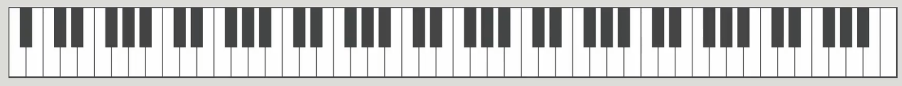
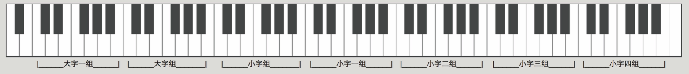
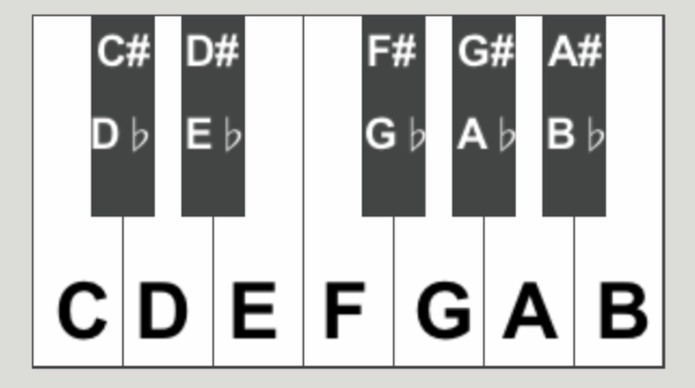
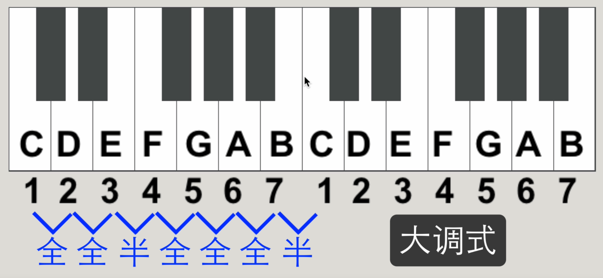
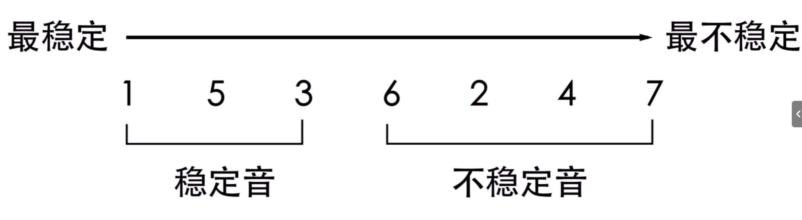
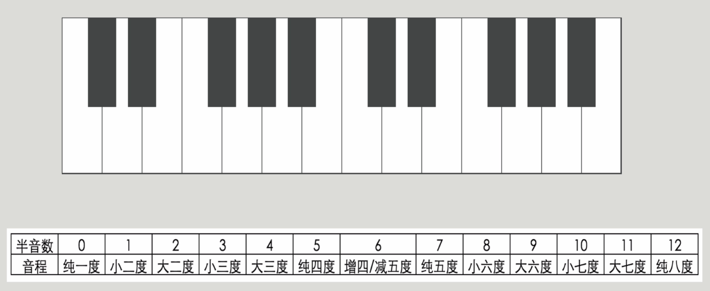
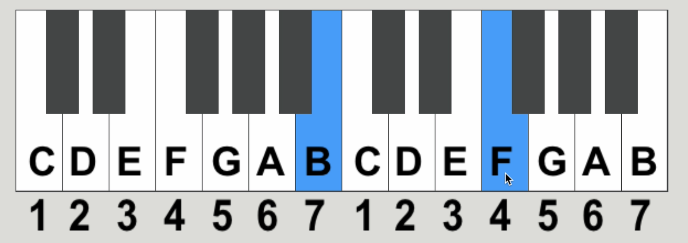
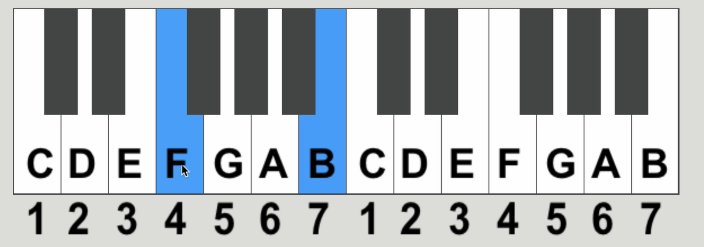
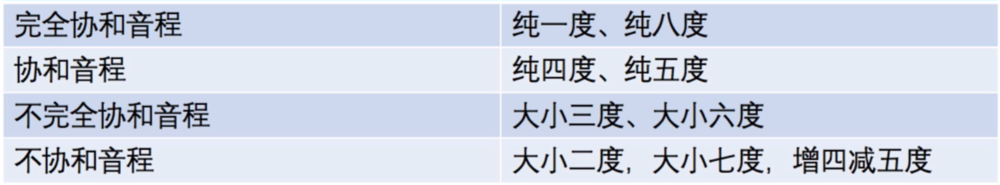

# 基础乐理
## 节奏
### 拍

  **拍**是音乐中用来衡量节奏的基本单位，它代表了音乐进行中的一个基本时间刻度。在乐谱中，拍通常由一个特定的音符时值来表示，如四分音符、八分音符等。例如，在4/4拍的乐曲中，以四分音符为一拍，每小节有四拍，此时四分音符的时值就代表了一拍的时长。拍的时值是一个相对的时间概念，它会根据乐曲的速度而变化。当速度确定后，每拍的实际时间也随之确定，进而决定了其他音符时值的长短。

### 速度

  **速度**是指音乐进行的快慢程度，它决定了音乐的整体节奏和情感表达。速度通常以每分钟的节拍数（BPM，Beats Per Minute）来衡量，例如，每分钟60拍的速度意味着每拍持续1秒。速度术语通常使用意大利语等外语词汇来表示，如“Adagio”表示慢速，“Allegro”表示快速。速度的设定会影响拍的实际时长，进而影响整个乐曲的节奏和演奏效果。

### 小节

  **小节**是乐谱中用来划分音乐结构的基本单位，它是由一定数量的拍子组成的独立部分。在乐谱中，小节线（竖线）将五线谱分成一个个小节，每个小节内的拍子数量由拍号决定。例如，在4/4拍的乐曲中，每个小节有四拍，可以容纳四个四分音符或等值的其他音符组合。小节的划分有助于音乐的组织和演奏者对音乐结构的理解。

### 节拍

  **节拍**是指音乐中具有规律性、周期性的强弱拍的组合，它是音乐节奏的基础。节拍通过强拍和弱拍的交替出现，形成一种有规律的脉动，使音乐具有韵律感。例如，在2/4拍的乐曲中，节拍呈现“强弱”的规律；而在3/4拍的乐曲中，节拍则是“强弱弱”的规律。节拍的强弱模式决定了音乐的节奏型和情感表达。

### 音符时值

  **音符时值**是指音符在音乐中持续的时间长度，它是一个相对的概念，需要与节拍绑定才能确定实际的时长。音符时值的长短通常以全音符为基准进行划分，如全音符的时值为4拍（在4/4拍中），二分音符为2拍，四分音符为1拍，八分音符为半拍等。音符时值的组合构成了音乐的节奏，不同的时值组合可以创造出丰富多样的节奏型。

## 钢琴键盘

### 键盘的构成

- **黑白键分布**：钢琴键盘由88个键组成，包括52个白键和36个黑键。白键代表基本音级，黑键代表变化音级。

- **音域广泛**：钢琴的音域从A0到C8，涵盖了多个八度，能够演奏出丰富的音高范围。

- **分组**：不同的标准会导致键盘对应的分组名并不相同，分组名并不是一成不变的

### 键盘的布局和排列

- **八度循环**：钢琴键盘以八度为一个循环单位，每个八度内有7个白键和5个黑键，按照固定的音程关系排列。
- **键位排列**：白键按照C、D、E、F、G、A、B的顺序排列，黑键则分为两个一组和三个一组交替排列，分别对应半音关系。

### 升降音符

- 升降音符通过在五线谱上添加升号（♯）或降号（♭）来改变音符的音高。升号表示将音符升高半音，降号表示将音符降低半音。
- 升降音有两种表示方式，可以用升也可以用降来表示一个升降音符。

## 调

### 大调音阶

大调音阶满足如下的音程模式关系：

- 全音 - 全音 - 半音 - 全音 - 全音 - 全音 - 半音

如下为C大调音阶的音程模式图

### 七音稳定性：

- 在C-D-E-F-G-A-B (1-2-3-4-5-6-7) 中的稳定程度如下：

注意：**不稳定音会倾向于稳定音**

## 音程

### 半音数与音程的关系：

- 半音数从零开始数
- 音程从一开始数

### 三全音：

- 三全音是指两个音符之间的音程距离为三个全音。它是音乐中一种特殊的音程，具有独特的听觉效果和理论意义。

- 三全音跨越三个全音，相当于一个纯四度增加一个半音，或者一个纯五度减少一个半音。即图中的：`增四减五度`

### 音程的转位

#### 音程的转位满足一下几个条件：

- 将要转位的音程下移八度
- 度数相加等于九
- 大小增减是互换 (如果是增四/减五度，互换完后是减五/增四度)
- 纯音程不变 (纯音程转位后还是纯音程，如：纯四度音程转位后为纯五度音程)

> 如：`B/F`对`F`转位：
>
> 
>
> 将其转为:
>
> 
>
> 其中的转位满足：
>
> - `B-F`与`F-B`中的`F`相差一个八度
> - `B-F`的音程为5，`F-B`的音程为4，音程相加度数为9
> - `B-F`为大三度音程，转位后`F-B`为小六度音程

#### 协和音程

音程的协和性满足如下的音程关系：

